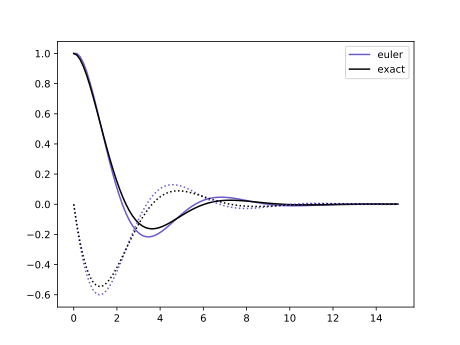
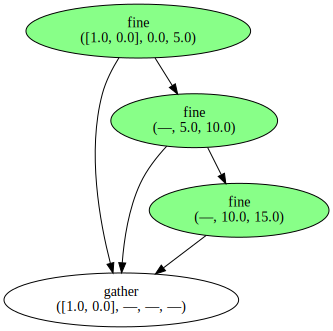
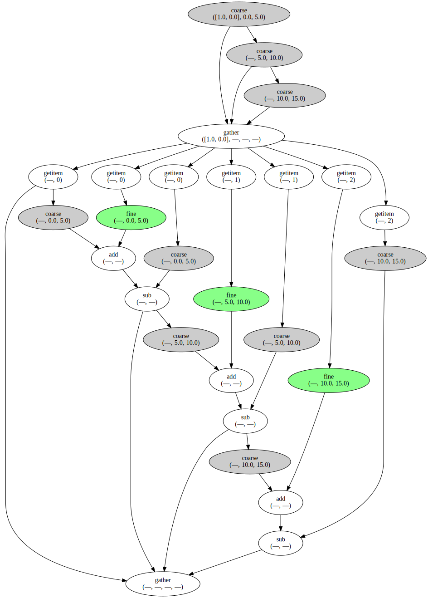

# Module

``` {.python file=paranoodles/__init__.py}
from .tabulate_solution import tabulate
from .parareal import parareal
from . import abstract

from noodles import schedule
from noodles.run.threading.sqlite3 import run_parallel as run

__all__ = ["tabulate", "parareal", "schedule",
           "run", "abstract", "schedule"]
```

# Problem statement

I tried to implement the problem statement using abstract base classes (`ABC` module) and the `typing` module. However, type annotation in Python is still an immature feature (to say the least, it's next to useless). The little annotation remaining should be considered documentation.

``` {.python file=paranoodles/abstract.py}
from __future__ import annotations  # enable self-reference in type annotations
from typing import (Callable, Protocol, TypeVar)
from abc import (ABC, abstractmethod)

<<abstract-types>>
Mapping = Callable[[TVector], TVector]
```

We have an ODE in the form

$$y' = f(y, t).$${#eq:ode}

Here $y$ can be a scalar value, a vector of values (say a `numpy` array), or any expression of *state*. A naive implementation of an ODE integrator would be

$$y_{n+1} = y_{n} + \Delta t f(y_{n}, t).$${#eq:euler-method}

+@eq:euler-method is known as the *forward Euler method*. We can capture the *state* $y$ in an abstract class we'll call `Vector`. We chose this name because we expect this objects to share (some of) the arithmetic properties of mathematical vectors. Namely, we want to be able to add, subtract and scale them. The chunk below states this need of a basic arithmetic in the form of abstract methods.

``` {.python #abstract-types}
TVector = TypeVar("TVector", bound="Vector")

class Vector(Protocol):
    def __add__(self: TVector, other: TVector) -> TVector:
        ...

    def __sub__(self: TVector, other: TVector) -> TVector:
        ...

    def __mul__(self: TVector, other: float) -> TVector:
        ...

    def __rmul__(self: TVector, other: float) -> TVector:
        ...

```

_The implementation of the actual methods can be found below in this document._

Note that we don't make a distinction here between a state vector and a vector representing a change in state. This may change in the future.

An ODE is then given as a function taking a `Vector` (the state $y$) and a `float` (the time $t$) returning a `Vector` (the derivative $y' = f(y,t)$ evaluated at $(y,t)$). We define the type `Problem`:

``` {.python #abstract-types}
Problem = Callable[[TVector, float], TVector]
```

In mathematical notation the snippet above means:

$$Problem : (y, t) \longrightarrow f(y, t) = y'$$

If we have a `Problem`, we're after a `Solution`: a function that, given an initial `Vector` (the initial condition $y_0$), initial time ($t_0$) and final time ($t$), gives the resulting `Vector` (the solution, $y(t)$ for the given initial conditions).

``` {.python #abstract-types}
Solution = Callable[[TVector, float, float], TVector]
```

Those readers more familiar with classical physics or mathematics may notice that our `Problem` object corresponds with the function $f$ in (+@eq:ode). The `Solution` object, on the other hand, corresponds with the evolution operator $\phi$ in equation @eq:solution.

$$Solution : (y_0, t_0; t) \longrightarrow \phi(y_0, t_0; t) = y(t).$${#eq:solution}

Intuitively, $\phi$ represents any method that solves (even approximately) our initial value problem. 

As a quick example, think of the differential equation $y' = ry$. This can be solved by analytical integration. The `Problem` and  `Solution` objects is in this case are:

$$ Problem : (y, t) \longrightarrow r y $$
$$ Solution : (y_0, t_0; t) \longrightarrow y_0 e^{r(t - t_0)} $$

The challenge is, of course, to find a way of transforming a `Problem` into a `Solution`. This is what integration algorithms do.

$$ Integration \ algorithm : Problem \longrightarrow Solution $$

If we look a bit closely at the definitions of `Problem` and `Solution` we'll notice that an integration algorithm is indeed a functional that accepts functions of $(y,t)$ as an input and returns functions of $(y_0, t_0, t)$ as an output.

$$ Integration \ algorithm : f \longrightarrow \phi $$

An example of such an integration algorithm is the forward Euler method (+@eq:euler-method), that can be implemented as:

``` {.python file=paranoodles/forward_euler.py}
from .abstract import (Vector, Problem, Solution)

def forward_euler(f: Problem) -> Solution:
    def step(y: Vector, t_0: float, t_1: float) -> Vector:
        """Stepping function of Euler method."""
        return y + (t_1 - t_0) * f(y, t_0)
    return step
```

Any existing solution can be iterated over to provide a solution over a larger time interval. The `iterate_solution` function runs a given solution with a step-size fixed to $\Delta t = h$.

<!--$${\rm Iter}[S, h]\Big|_{t_0, y = y}^{t_1} = \begin{cases}-->
<!--y & t_0 = t_1 \\-->
<!--{\rm Iter}[S, h]\big|_{t_0 + h, y = S(y, t_0, t_0 + h)}^{t_1} & {\rm otherwise}-->
<!--\end{cases}.$$-->

``` {.python file=paranoodles/iterate_solution.py}
from .abstract import (Vector, Solution)
import numpy as np
import math

def iterate_solution(step: Solution, h: float) -> Solution:
    def iter_step(y: Vector, t_0: float, t_1: float) -> Vector:
        """Stepping function of iterated solution."""
        n = math.ceil((t_1 - t_0) / h)
        steps = np.arange(t_0, t_1, n + 1)
        for t_a, t_b in zip(steps[:-1], steps[1:]):
            y = step(y, t_a, t_b)
        return y
    return iter_step
```

## Example: damped harmonic oscillator

The harmonic oscillator can model the movement of a pendulum or the vibration of a mass on a string.

$$y'' + 2\zeta \omega_0 y' + \omega_0^2 y = 0,$$

where $\omega_0 = \sqrt{k/m}$ and $\zeta = c / 2\sqrt{mk}$, $k$ being the spring constant, $m$ the test mass and $c$ the friction constant.

To solve this second order ODE we need to introduce a second variable to solve for. Say $q = y$ and $p = y'$.

$$\begin{aligned}
    q' &= p\\
    p' &= -2\zeta \omega_0 p + \omega_0^2 q
\end{aligned}$$ {#eq:harmonic-oscillator}

The `Problem` is then given as

``` {.python file=paranoodles/harmonic_oscillator.py}
from .abstract import (Problem)
import numpy as np

def harmonic_oscillator(omega_0: float, zeta: float) -> Problem:
    def f(y, t):
        return np.r_[y[1], -2 * zeta * omega_0 * y[1] - omega_0**2 * y[0]]
    return f

<<harmonic-oscillator-solution>>
```

### Exact solution

The damped harmonic oscillator has an exact solution, given the ansatz $y = A \exp(z t)$, we get

$$z_{\pm} = \omega_0\left(-\zeta \pm \sqrt{\zeta^2 - 1}\right).$$

and thus the general solution:

$$y(t) = A \exp(z_+ t) + B \exp(z_- t) \ : \zeta \neq 1 $$
$$y(t) = (A + Bt) \exp(-\omega_0 t) : \zeta = 1 $$

This dynamical system has three qualitatively different solutions, each of them depending on the sign of the contents of the square root. Particularly, if the contents of the square root are negative, the two possible values for $z$ will be complex numbers, making oscillations possible. More specifically, the three cases are:

- *overdamped* ($\zeta > 1$ and, thus, both $z$ are real numbers)
- *critical dampening* ($\zeta = 1$ and $z$ is real and equal to $-\omega_0$)
- *underdamped* ($\mid \zeta \mid < 1$, and $z = -\omega_0\zeta \mp i \omega_0 \sqrt{1 - \zeta^2}$).

The underdamped case is typically the most interesting one. In this case we have solutions of the form:

$$y = A\quad \underbrace{\exp(-\omega_0\zeta t)}_{\rm dampening}\quad\underbrace{\exp(\pm i \omega_0 \sqrt{1 - \zeta^2} t)}_{\rm oscillation},$$

Given an initial condition $q_0 = 1, p_0 = 0$, the solution is computed as

``` {.python #harmonic-oscillator-solution}
def underdamped_solution(omega_0: float, zeta: float) -> np.ndarray:
    amp   = 1 / np.sqrt(1 - zeta**2)
    phase = np.arcsin(zeta)
    freq  = omega_0 * np.sqrt(1 - zeta**2)

    def f(t):
        dampening = np.exp(-omega_0*zeta*t)
        q = amp * dampening * np.cos(freq * t - phase)
        p = - amp * omega_0 * dampening * np.sin(freq * t)
        return np.c_[q, p]
    return f
```

### Numeric solution

To plot a `Solution`, we need to tabulate the results for a given sequence of time points.

``` {.python file=paranoodles/tabulate_solution.py}
from .abstract import (Solution, Vector)
from typing import (Sequence, Any)
import numpy as np

Array = Any

def tabulate(step: Solution, y_0: Vector, t: Array) -> Sequence[Vector]:
    """Tabulate the step-wise solution, starting from `y_0`, for every time
    point given in array `t`."""
    if isinstance(y_0, np.ndarray):
        return tabulate_np(step, y_0, t)

    y = [y_0]
    for i in range(1, t.size):
        y_i = step(y[i-1], t[i-1], t[i])
        y.append(y_i)
    return y

<<tabulate-np>>
```

In the case that the `Vector` type is actually a numpy array, we can specialize the `tabulate` routine to return a larger array.

``` {.python #tabulate-np}
def tabulate_np(step: Solution, y_0: Array, t: Array) -> Array:
    y = np.zeros(dtype=y_0.dtype, shape=(t.size,) + y_0.shape)
    y[0] = y_0
    for i in range(1, t.size):
        y[i] = step(y[i-1], t[i-1], t[i])
    return y
```

### Plotting the harmonic oscillator

``` {.python #plot-harmonic-oscillator}
import matplotlib.pylab as plt
import numpy as np

from paranoodles.harmonic_oscillator import \
    ( harmonic_oscillator, underdamped_solution )
from paranoodles.forward_euler import \
    ( forward_euler )
from paranoodles.tabulate_solution import \
    ( tabulate )

omega_0 = 1.0
zeta = 0.5
f = harmonic_oscillator(omega_0, zeta)
t = np.linspace(0.0, 15.0, 100)
y_euler = tabulate(forward_euler(f), np.r_[1.0, 0.0], t)
y_exact = underdamped_solution(omega_0, zeta)(t)

plt.plot(t, y_euler[:,0], color='slateblue', label="euler")
plt.plot(t, y_exact[:,0], color='k', label="exact")
plt.plot(t, y_euler[:,1], color='slateblue', linestyle=':')
plt.plot(t, y_exact[:,1], color='k', linestyle=':')
plt.legend()
plt.savefig("harmonic.svg")
```



# Parareal

From Wikipedia:

> Parareal solves an initial value problem of the form
>
> $$\dot{y}(t) = f(y(t), t), \quad y(t_0) = y_0 \quad \text{with} \quad t_0 \leq t \leq T.$$
>
> Here, the right hand side $f$ can correspond to the spatial discretization of a partial differential equation in a method of lines approach.
> Parareal now requires a decomposition of the time interval $[t_0, T]$ into $P$ so-called time slices $[t_j, t_{j+1}]$ such that
>
> $$[t_0, T] = [t_0, t_1] \cup [t_1, t_2] \cup \ldots \cup [t_{P-1}, t_{P} ].$$
>
> Each time slice is assigned to one processing unit when parallelizing the algorithm, so that $P$ is equal to the number of processing units used for Parareal.
>
> Parareal is based on the iterative application of two methods for integration of ordinary differential equations. One, commonly labelled ${\mathcal {F}}$, should be of high accuracy and computational cost while the other, typically labelled ${\mathcal {G}}$, must be computationally cheap but can be much less accurate. Typically, some form of Runge-Kutta method is chosen for both coarse and fine integrator, where ${\mathcal {G}}$ might be of lower order and use a larger time step than ${\mathcal {F}}$. If the initial value problem stems from the discretization of a PDE, ${\mathcal {G}}$ can also use a coarser spatial discretization, but this can negatively impact convergence unless high order interpolation is used. The result of numerical integration with one of these methods over a time slice $[t_{j}, t_{j+1}]$ for some starting value $y_{j}$ given at $t_{j}$ is then written as
>
> $$y = \mathcal{F}(y_j, t_j, t_{j+1})\ {\rm or}\ y = \mathcal{G}(y_j, t_j, t_{j+1}).$$
>
> Serial time integration with the fine method would then correspond to a step-by-step computation of
>
> $$y_{j+1} = \mathcal{F}(y_j, t_j, t_{j+1}), \quad j=0, \ldots, P-1.$$
>
> Parareal instead uses the following iteration
>
> $$y_{j+1}^{k+1} = \mathcal{G}(y^{k+1}_j, t_j, t_{j+1}) + \mathcal{F}(y^k_j, t_j, t_{j+1}) - \mathcal{G}(y^k_j, t_j, t_{j+1}),\\ \quad j=0, \ldots, P-1, \quad k=0, \ldots, K-1,$$
>
> where $k$ is the iteration counter. As the iteration converges and $y^{k+1}_j - y^k_j \to 0$, the terms from the coarse method cancel out and Parareal reproduces the solution that is obtained by the serial execution of the fine method only. It can be shown that Parareal converges after a maximum of $P$ iterations. For Parareal to provide speedup, however, it has to converge in a number of iterations significantly smaller than the number of time slices, that is $K \ll P$.
>
> In the Parareal iteration, the computationally expensive evaluation of $\mathcal{F}(y^k_j, t_j, t_{j+1})$ can be performed in parallel on $P$ processing units. By contrast, the dependency of $y^{k+1}_{j+1}$ on $\mathcal{G}(y^{k+1}_j, t_j, t_{j+1})$ means that the coarse correction has to be computed in serial order.

Don't get blinded by the details of the algorithm. After all, everything boils down to an update equation that uses a state vector $y$ to calculate the state at the immediately next future step (in the same fashion as equation +@eq:euler-method did). The core equation translates to:

``` {.python #parareal-core}
y_n[i] = coarse(y_n[i-1], t[i-1], t[i]) \
       + fine(y[i-1], t[i-1], t[i]) \
       - coarse(y[i-1], t[i-1], t[i])
```

The rest is boiler plate.

``` {.python file=paranoodles/parareal.py}
from .abstract import (Solution, Mapping)

def identity(x):
    return x

```

## Including mapping between meshes

``` {.python file=paranoodles/parareal.py}
def parareal(
        coarse: Solution,
        fine: Solution,
        c2f: Mapping = identity,
        f2c: Mapping = identity):
    def f(y, t):
        m = t.size
        y_n = [None] * m
        y_n[0] = y[0]
        for i in range(1, m):
            y_n[i] = c2f(coarse(f2c(y_n[i-1]), t[i-1], t[i])) \
                   + fine(y[i-1], t[i-1], t[i]) \
                   - c2f(coarse(f2c(y[i-1]), t[i-1], t[i]))
        return y_n
    return f
```

## Noodlify

The way we implemented the `parareal` function is not very efficient. It's Python, there's a recursion in the dependency, so no way to sweeten it up with `numpy`. Suppose however, that the `fine` solution may take a while to compute, and we only use Python to steer the computation. How can we paralellise the implementation of `parareal`? The answer is: we don't need to! Noodles can do it for us.

``` {.python #import-noodles}
import noodles
```

``` {.python #noodlify}
<<import-noodles>>
import numpy as np
from noodles.draw_workflow import draw_workflow

from paranoodles.harmonic_oscillator import \
    ( harmonic_oscillator, underdamped_solution )
from paranoodles.forward_euler import \
    ( forward_euler )
from paranoodles.tabulate_solution import \
    ( tabulate )
from paranoodles.parareal import \
    ( parareal )
```

To see what Noodles does, first we'll noodlify the direct integration routine in `tabulate`. We take the same harmonic oscillator we had before. For the sake of argument let's divide the time line in three steps (so four points).

``` {.python #noodlify}
omega_0 = 1.0
zeta = 0.5
f = harmonic_oscillator(omega_0, zeta)
t = np.linspace(0.0, 15.0, 4)
```

We now define the `fine` integrator:

```{.python #noodlify}
h = 0.01

@noodles.schedule
def fine(x, t_0, t_1):
    return iterate_solution(forward_euler(f), h)(x, t_0, t_1)
```

It doesn't really matter what the fine integrator does, since we won't run anything. We'll just pretend. The `noodles.schedule` decorator makes sure that the integrator is never called, we just store the information that we *want* to call the `fine` function. The resulting value is a *promise* that at some point we *will* call the `fine` function. The nice thing is, that this promise behaves like any other Python object, it even qualifies as a `Vector`! The `tabulate` routine returns a `Sequence` of `Vector`s, in this case a list of promises. The `noodles.gather` function takes a list of promises and turns it into a promise of a list (in fact, its definition boils down to `noodles.schedule(list)`).

``` {.python #noodlify}
y_euler = noodles.gather(
    *tabulate(fine, [1.0, 0.0], t))
```

We can draw the resulting workflow:

``` {.python #noodlify}
def paint(node, name):
    if name == "coarse":
        node.attr["fillcolor"] = "#cccccc"
    elif name == "fine":
        node.attr["fillcolor"] = "#88ff88"
    else:
        node.attr["fillcolor"] = "#ffffff"

draw_workflow('seq-graph.svg', noodles.get_workflow(y_euler), paint)
```

{width=50%}

This workflow is entirely sequential, every step depending on the preceding one. Now for Parareal! We also define the `coarse` integrator.

``` {.python #noodlify}
@noodles.schedule
def coarse(x, t_0, t_1):
    return forward_euler(f)(x, t_0, t_1)
```

Parareal is initialised with the ODE integrated by the coarse integrator, just like we did before with the fine one.

``` {.python #noodlify}
y_first = noodles.gather(*tabulate(coarse, [1.0, 0.0], t))
```

We can now perform a single iteration of Parareal to see what the workflow looks like:

``` {.python #noodlify}
y_parareal = noodles.gather(*parareal(coarse, fine)(y_first, t))
```

``` {.python #noodlify}
draw_workflow('parareal-graph.svg', noodles.get_workflow(y_parareal), paint)
```



# Create example file

``` {.python file=examples/harmonic_oscillator.py}
<<plot-harmonic-oscillator>>

<<noodlify>>
```

